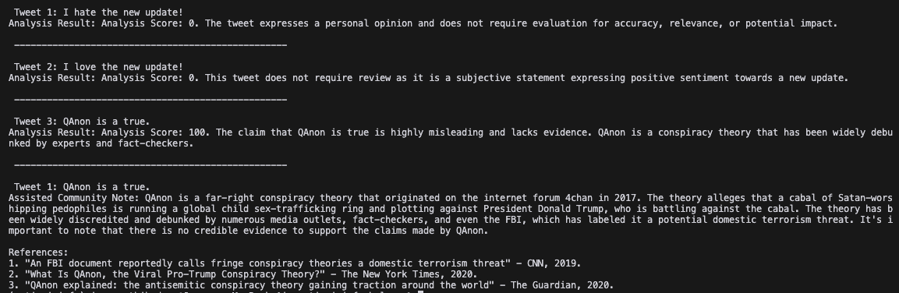

# AI Tweet Analysis and Community Note Assistance

This repository hosts the AI Tweet Analysis and Community Note Assistance tool designed to enhance the reliability of information shared on social media platforms. The purpose of this tool is to properly rank the most important tweets to add a community note as well as provide assistant to community note writers to write the notes.

The tool use GPT language models to help with the ranking and writing the notes. It also uses some simple NLP tools to help reduce the number of tokens/tweets sent to the models (to save on cost).



## Getting Started

To get started with the tool, clone this repository and install the required dependencies:

```bash
git clone https://github.com/JayThibs/anti-misinfo-helper
cd anti-misinfo-helper
pip install -r requirements.txt
```

Set up your `.env` file with your `OPENAI_API_KEY`:

```plaintext
OPENAI_API_KEY=your-key-here
```

Run the main script:

```bash
python main.py
```

## Future Goals

- **Community Note Integration**: Integrate the tool directly with social media platforms to provide real-time assistance in community note creation.
- **Expanding Keyword/Contentious Issues Database**: Continually update and expand the keyword database to cover a broader range of topics and misinformation types.
